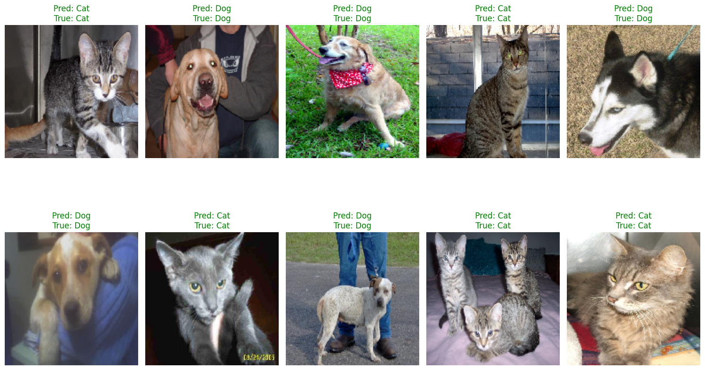

# Cats vs Dogs Image Classification

This project builds a binary image classification model to distinguish between images of **cats** and **dogs** using a Convolutional Neural Network (CNN) built with **TensorFlow/Keras**.

## 📂 Dataset

- **Source:** [Microsoft Cats and Dogs Dataset](https://www.microsoft.com/en-us/download/details.aspx?id=54765)
- The dataset contains two folders: `/Cat` and `/Dog` with thousands of `.jpg` images.

## ⚙️ Project Workflow

1. **Data Preparation**
   - Download and unzip the dataset
   - Remove corrupted and non-image files
   - Split into training (90%) and validation (10%) sets

2. **Data Augmentation & Preprocessing**
   - Apply data augmentation for better generalization:
     - Rotation, zoom, shift, flip, etc.
   - Normalize pixel values to `[0, 1]`

3. **Model Architecture**
   - Custom CNN with:
     - 4 convolutional layers
     - Max pooling after each conv layer
     - Dropout for regularization
     - Flatten and Dense layers
   - Output layer with sigmoid activation for binary classification

4. **Training**
   - Optimizer: RMSprop
   - Loss: Binary Crossentropy
   - Epochs: Up to 30 (with early stopping)

5. **Evaluation**
   - Accuracy and loss curves per epoch
   - Visualization of sample predictions on validation data

## 🧠 Model Performance

- Achieved **~85–90% validation accuracy**
- 6/10 prediction accuracy on raw validation samples (before improvements)
- Can distinguish between cats and dogs in most cases

## 🛠️ Tech Stack

- Python
- TensorFlow / Keras
- Matplotlib
- NumPy
- Google Colab (recommended)

## 📸 Example Prediction



```text
Predicted: Dog | Actual: Dog
Predicted: Cat | Actual: Cat
Predicted: Dog | Actual: Cat ❌
...
